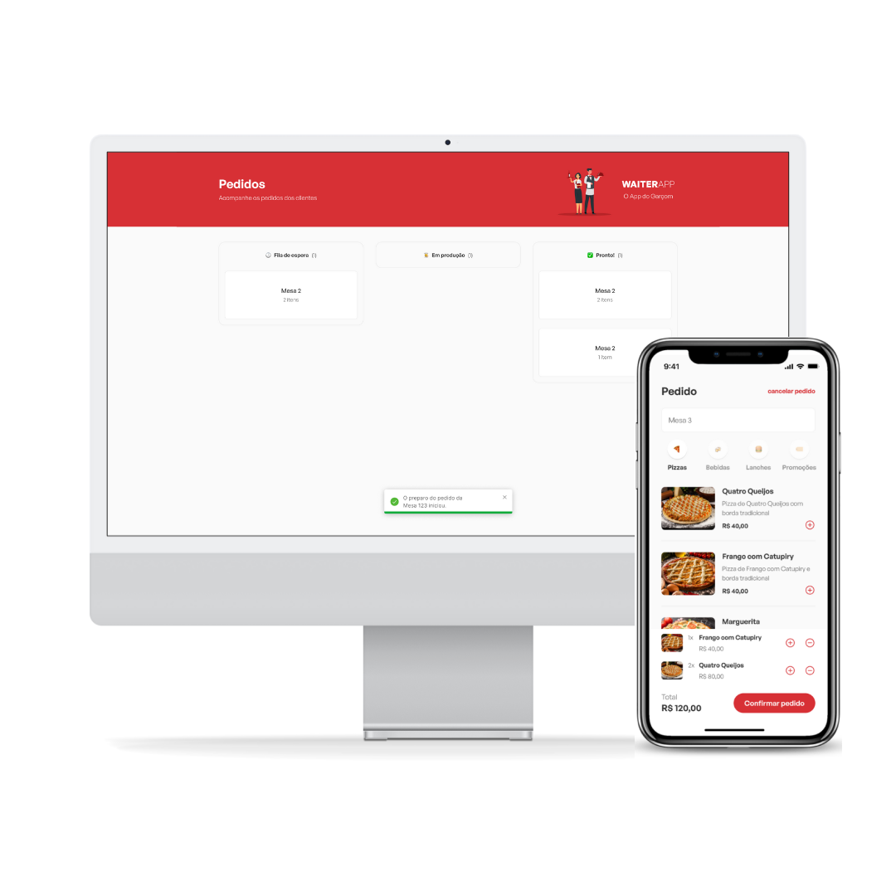

# WAITERAPP

## About

WAITERAPP is an ordering application for a restaurant, developed during the event O Poder do Javascript #2, created and presented by Mateus Silva.

With it, orders are placed on the mobile application interface and sent to the web dashboard for the kitchen to prepare orders.

## Author

- [LinkedIn](https://www.linkedin.com/in/kevenpacheco/)
