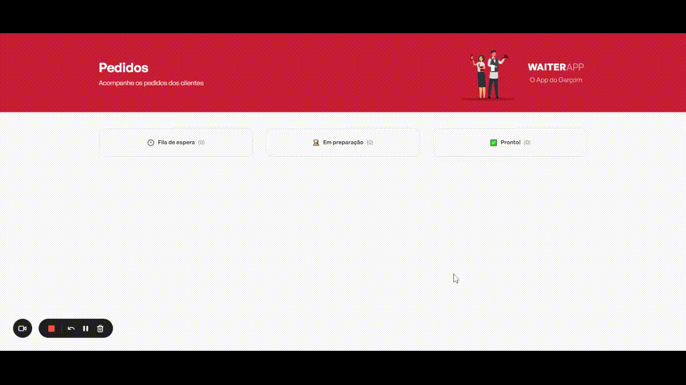

# WAITERAPP - Web

## 📋 Table of contents

- [About](#about)
- [Step by step to use the application](#step-by-step-to-use-the-application)
- [Built with](#built-with)
- [Author](#author)

## 📃 About

The web application presents the user with the entire list of orders made by the mobile application, separated into the columns of "Waiting queue", "In production" and "Ready!".

The application uses a connection via websocket, which records the production's initial column in real time with the requests made by the mobile application.

The web app features consist of:

- List orders between the 3 production queue tables;
- View order details;
- Change order status between production queue tables;
- Cancel/delete an order at any time.



## 🚀 Step by step to use the application

1 - Install the dependencies:

```
  npm install
```

2 - Run de web aplication in development mode:

```
  npm run dev
```

## 🔧 Built with

- [React JS](https://pt-br.reactjs.org/)
- [Typescript](https://www.typescriptlang.org/)
- [Styled-components](https://styled-components.com/)
- [Axios](https://axios-http.com/ptbr/)
- [Vite](https://vitejs.dev/)
- Websocket

## 🤵 Author

- [LinkedIn](https://www.linkedin.com/in/kevenpacheco/)
